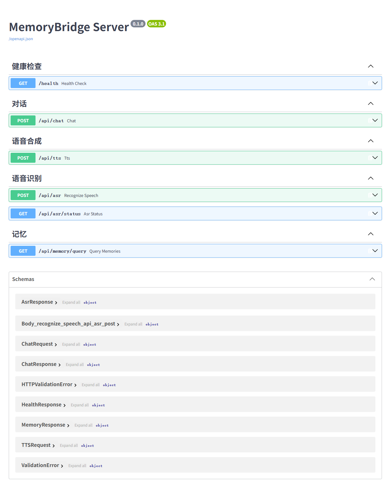

# MemoryBridge API 文档

> Base URL: `http://localhost:8000`
> Swagger UI: `http://localhost:8000/docs`
> OpenAPI Schema: `http://localhost:8000/openapi.json`
> 版本: 0.1.0

---

## 端点总览

| 方法 | 路径 | 说明 |
|------|------|------|
| GET | `/health` | 健康检查 |
| POST | `/api/chat` | 对话（核心） |
| POST | `/api/tts` | 语音合成 |
| POST | `/api/asr` | 语音识别 |
| GET | `/api/asr/status` | ASR 服务状态 |
| GET | `/api/memory/query` | 记忆检索（调试） |



---

## 1. GET /health

健康检查，返回服务状态与版本号。

### 请求

```
GET /health
```

无请求参数。

### 响应 (200)

```json
{
  "status": "ok",
  "version": "0.1.0",
  "timestamp": "2026-08-20T14:15:44.867199"
}
```

| 字段 | 类型 | 说明 |
|------|------|------|
| status | string | 固定 "ok" |
| version | string | 应用版本号 |
| timestamp | datetime | 当前时间戳 |

### curl 示例

```bash
curl http://localhost:8000/health
```

---

## 2. POST /api/chat

核心对话接口。接收用户文本，检索相关记忆，调用 LLM 生成回复。

### 请求

```
POST /api/chat
Content-Type: application/json
```

```json
{
  "text": "你好呀",
  "user_id": 1,
  "session_id": "uuid-session-1"
}
```

| 字段 | 类型 | 必填 | 说明 |
|------|------|------|------|
| text | string | 是 | 用户输入（1-2000 字） |
| user_id | int | 是 | 用户 ID |
| session_id | string | 是 | 会话 ID（UUID） |

### 响应 (200)

```json
{
  "reply": "你好呀，今天天气不错呢。你想聊点什么？",
  "session_id": "uuid-session-1",
  "memories_used": 3
}
```

| 字段 | 类型 | 说明 |
|------|------|------|
| reply | string | AI 回复文本 |
| session_id | string | 会话 ID（回传） |
| memories_used | int | 本次检索到的记忆条数 |

### 错误响应

| 状态码 | 场景 | 说明 |
|--------|------|------|
| 422 | 缺少必填字段 / text 为空 | Pydantic 校验失败 |
| 500 | LLM 不可用 / 数据库连接失败 | 服务端异常 |

### curl 示例

```bash
curl -X POST http://localhost:8000/api/chat \
  -H "Content-Type: application/json" \
  -d '{"text":"你好呀","user_id":1,"session_id":"session-1"}'
```

---

## 3. POST /api/tts

语音合成，返回 MP3 音频。

**降级机制**: edge-tts（在线）失败时自动切换到 pyttsx3（离线）。
响应头 `X-TTS-Engine` 标明使用的引擎。

### 请求

```
POST /api/tts
Content-Type: application/json
```

```json
{
  "text": "你好呀，今天天气不错",
  "voice": "zh-CN-XiaoxiaoNeural",
  "rate": "+0%",
  "volume": "+0%"
}
```

| 字段 | 类型 | 必填 | 默认 | 说明 |
|------|------|------|------|------|
| text | string | 是 | - | 待合成文本（1-500 字） |
| voice | string | 否 | zh-CN-XiaoxiaoNeural | 语音角色 |
| rate | string | 否 | +0% | 语速（如 +10%） |
| volume | string | 否 | +0% | 音量（如 +20%） |

### 响应 (200)

```
Content-Type: audio/mpeg
Content-Disposition: inline; filename=tts.mp3
X-TTS-Engine: edge
Cache-Control: no-cache

<MP3 二进制数据>
```

| 响应头 | 说明 |
|--------|------|
| Content-Type | 固定 audio/mpeg |
| X-TTS-Engine | "edge"（在线）或 "offline"（离线降级） |
| Content-Disposition | inline; filename=tts.mp3 |

### 错误响应

| 状态码 | 场景 | 说明 |
|--------|------|------|
| 422 | text 为空 | Pydantic 校验失败 |
| 503 | 所有 TTS 引擎均不可用 | edge-tts 和 pyttsx3 都失败 |

### curl 示例

```bash
# 保存到文件
curl -X POST http://localhost:8000/api/tts \
  -H "Content-Type: application/json" \
  -d '{"text":"你好呀"}' \
  -o tts.mp3

# 查看使用的引擎
curl -X POST http://localhost:8000/api/tts \
  -H "Content-Type: application/json" \
  -d '{"text":"你好呀"}' -D - -o /dev/null
```

---

## 4. POST /api/asr

语音识别，上传 WAV 音频返回识别文本。

### 请求

```
POST /api/asr
Content-Type: multipart/form-data
```

| 字段 | 类型 | 必填 | 说明 |
|------|------|------|------|
| file | file | 是 | WAV 音频文件（16kHz, mono, 16-bit PCM） |
| language | string | 否 | 语言，默认 "zh" |

### 响应 (200)

```json
{
  "text": "你好世界",
  "backend": "simple",
  "duration_ms": 1200
}
```

| 字段 | 类型 | 说明 |
|------|------|------|
| text | string | 识别出的文本，空字符串表示识别失败 |
| backend | string | ASR 后端: funasr / whisper / simple |
| duration_ms | int | 识别耗时（毫秒） |

### curl 示例

```bash
curl -X POST http://localhost:8000/api/asr \
  -F "file=@audio.wav" \
  -F "language=zh"
```

---

## 5. GET /api/asr/status

查询 ASR 服务状态和后端配置。

### 请求

```
GET /api/asr/status
```

无请求参数。

### 响应 (200)

```json
{
  "backend": "simple",
  "available": true,
  "timeout": 15
}
```

| 字段 | 类型 | 说明 |
|------|------|------|
| backend | string | 当前 ASR 后端: funasr / whisper / simple |
| available | bool | ASR 服务是否可用 |
| timeout | int | 识别超时时间（秒） |

### curl 示例

```bash
curl http://localhost:8000/api/asr/status
```

---

## 6. GET /api/memory/query

记忆向量检索（调试用）。返回与查询文本最相关的记忆条目。

### 请求

```
GET /api/memory/query?user_id=1&query=我叫什么名字&top_k=5
```

| 参数 | 类型 | 必填 | 默认 | 说明 |
|------|------|------|------|------|
| user_id | int | 是 | - | 用户 ID |
| query | string | 是 | - | 检索文本（1-500 字） |
| top_k | int | 否 | 0（用配置默认 5） | 返回条数 |

### 响应 (200)

```json
[
  {
    "content": "我叫张奶奶",
    "category": "family",
    "importance": 3,
    "score": 0.92
  },
  {
    "content": "我喜欢听戏曲",
    "category": "hobby",
    "importance": 2,
    "score": 0.78
  }
]
```

| 字段 | 类型 | 说明 |
|------|------|------|
| content | string | 记忆文本内容 |
| category | string | 分类: family / hobby / event 等 |
| importance | int | 重要程度 1-5 |
| score | float | 相似度分数（0-1，越高越相关） |

### 错误响应

| 状态码 | 场景 | 说明 |
|--------|------|------|
| 422 | 缺少必填参数 | Query 参数校验失败 |
| 500 | 数据库不可用 | PostgreSQL / pgvector 连接失败 |

### curl 示例

```bash
curl "http://localhost:8000/api/memory/query?user_id=1&query=我叫什么名字&top_k=5"
```

---

## 数据模型 (Schemas)

### ChatRequest
| 字段 | 类型 | 必填 | 说明 |
|------|------|------|------|
| text | string | 是 | 1-2000 字 |
| user_id | int | 是 | 用户 ID |
| session_id | string | 是 | 会话 ID |

### ChatResponse
| 字段 | 类型 | 说明 |
|------|------|------|
| reply | string | AI 回复 |
| session_id | string | 会话 ID |
| memories_used | int | 记忆条数 |

### TTSRequest
| 字段 | 类型 | 必填 | 默认 | 说明 |
|------|------|------|------|------|
| text | string | 是 | - | 1-500 字 |
| voice | string | 否 | null | 语音角色 |
| rate | string | 否 | null | 语速 |
| volume | string | 否 | null | 音量 |

### AsrResponse
| 字段 | 类型 | 说明 |
|------|------|------|
| text | string | 识别文本 |
| backend | string | ASR 后端 |
| duration_ms | int | 耗时(ms) |

### HealthResponse
| 字段 | 类型 | 说明 |
|------|------|------|
| status | string | "ok" |
| version | string | 版本号 |
| timestamp | datetime | 时间戳 |

### MemoryResponse
| 字段 | 类型 | 说明 |
|------|------|------|
| content | string | 记忆内容 |
| category | string | 分类 |
| importance | int | 重要程度 |
| score | float | 相似度 |

---

## TTS 降级机制

```
请求 /api/tts
  │
  ├─ 尝试 edge-tts（在线，音质好）
  │   ├─ 成功 → 返回 MP3，X-TTS-Engine: edge
  │   └─ 失败 → 重试 1 次
  │       └─ 仍失败 → 降级
  │
  ├─ 降级到 pyttsx3（离线 SAPI5）
  │   ├─ 生成 WAV → pydub 转 MP3
  │   └─ 成功 → 返回 MP3，X-TTS-Engine: offline
  │
  └─ 全部失败 → 503 Service Unavailable
```

| 引擎 | 音质 | 需要网络 | 延迟 |
|------|------|---------|------|
| edge-tts | 高（自然人声） | 是 | ~1-2s |
| pyttsx3 | 中（机械合成） | 否 | ~0.5s |

---

## 配置参考

所有配置通过 `server/.env` 文件管理，参见 `.env.example`。

关键配置项：

| 配置 | 默认值 | 说明 |
|------|--------|------|
| HOST | 0.0.0.0 | 监听地址 |
| PORT | 8000 | 监听端口 |
| LLM_MODE | api | LLM 模式: api / ollama |
| LLM_PROVIDER | deepseek | API 提供商: deepseek / qwen |
| ASR_BACKEND | simple | ASR 后端: funasr / whisper / simple |
| TTS_VOICE | zh-CN-XiaoxiaoNeural | edge-tts 语音角色 |
| TTS_EDGE_RETRY | 1 | edge-tts 失败重试次数 |
| TTS_OFFLINE_VOICE | TTS_MS_ZH-CN_HUIHUI_11.0 | pyttsx3 离线语音 |
| MEMORY_TOP_K | 5 | 记忆检索返回条数 |
